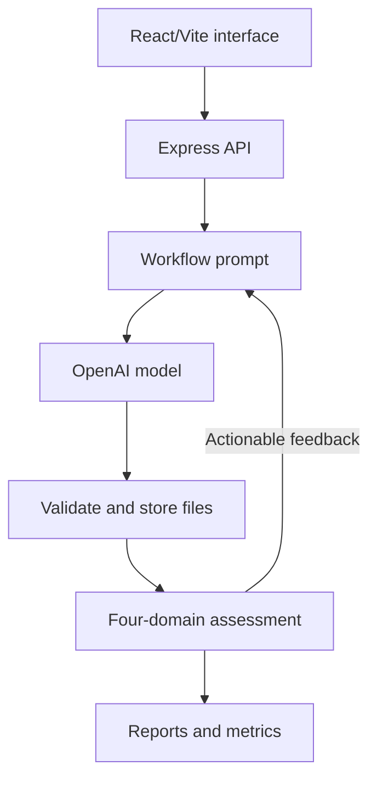

# AQuA — AI Quality Assessment Pipeline

AQuA is the software artefact developed for an MSc Computer Science dissertation investigating how different levels of guidance affect the measurable quality and development efficiency of AI-generated web applications.

The repository contains the React/Vite interface, Node.js/Express generation and evaluation server, three fixed application specifications, three development workflows, the preserved 90-run formal experiment, and the complete analysis workspace.

## Research question

> How does the level of guidance in AI-assisted development affect the measurable quality and development efficiency of generated web applications?

## Compared workflows

1. **One-shot generation** — one generation request containing the functional specification, testability contract and output requirements.
2. **Quality-focused prompting** — the same task with additional up-front requirements for semantic HTML, accessibility, validation, responsive layout and organised JavaScript.
3. **Automated refinement** — iteration 0 uses the one-shot prompt; later calls receive the current application and observed static, runtime, accessibility and functional feedback. Refinement stops when no actionable feedback remains or after three post-baseline calls.

## Application specifications

- To-do list
- Three-question multiple-choice quiz
- Appointment-booking form

All three applications use HTML, CSS and vanilla JavaScript, retain state only for the current browser session, and expose fixed `data-testid` hooks for deterministic functional evaluation.

## Evaluation pipeline

AQuA keeps the quality domains separate rather than combining them into a weighted score.

| Domain | Implementation | Recorded evidence |
| --- | --- | --- |
| Static quality | HTMLHint, ESLint and Stylelint | HTML, JavaScript and CSS messages, errors, warnings and pass flags |
| Runtime behaviour | Playwright Chromium | Navigation, visible content, console errors, uncaught exceptions and required controls |
| Accessibility | axe-core through Playwright | WCAG 2.0/2.1 A and AA tagged violations, affected nodes, impact and incomplete checks |
| Functional correctness | Specification-derived Playwright suites | Independent behavioural tests; every test must pass for the domain to pass |
| Efficiency | Experiment metrics | AI-generation duration, total workflow duration, pipeline overhead, tokens and refinement count |



The feedback edge is used only by the automated-refinement workflow.

## Formal experiment

The dissertation dataset is preserved at commit:

`6664cf9b0ba34d7b12e275a6d53e72b80d105f80`

| Setting | Recorded value |
| --- | --- |
| Experiment ID | `experiment-2026-08-03T14-15-25-809Z-f77080fe` |
| Design | 3 workflows × 3 specifications × 10 repetitions = 90 runs |
| Provider and model | OpenAI `gpt-5.6-luna` |
| Temperature | `0` |
| Random seed | `77077` |
| Run order | Sequential, seeded-random |
| Prompt version | `1.0.0` |
| Maximum refinements | 3 after iteration 0 |
| Completion | 90 completed; 0 failed |

### Headline results

| Workflow | Final all-check passes | Median AI-generation time | Median total tokens |
| --- | ---: | ---: | ---: |
| One-shot | 2/30 (6.7%) | 23.72 s | 3,495.5 |
| Quality-focused | 19/30 (63.3%) | 19.96 s | 3,689.5 |
| Automated refinement | 30/30 (100.0%) | 46.90 s | 10,925 |

Every pairwise difference in final all-check pass rate remained significant after Holm correction (`p < .001`). Accessibility was the clearest domain difference: 3/30 one-shot applications passed the final accessibility check, compared with 30/30 in both guided workflows. Colour-contrast failures occurred in 26/30 one-shot generations and 24/30 automated iteration-0 generations.

These results describe the fixed experimental configuration. They do not establish production readiness, complete accessibility conformance or a universal ranking of AI-assisted development workflows.

## Repository structure

```text
client/          React/Vite interface
server/          Express API, prompts, specifications, quality services and experiment runner
experiments/     Preserved raw formal experiment manifest, datasets and response records
analysis/        Validation, preprocessing, notebooks, tables and figures
docs/            Historical development notes and design decisions
generated-apps/  Local generated-run workspace; formal experiment applications are in experiments/
```

## Local setup

### Prerequisites

- Node.js and npm
- Python 3.12 recommended for the analysis workspace; the formal notebooks were executed using Python 3.12.6
- An OpenAI API key for new generations or experiments
- Chromium installed through Playwright

### Install

From the repository root:

```powershell
npm run install:all
Copy-Item server/.env.example server/.env
cd server
npx playwright install chromium
cd ..
```

Add the OpenAI API key to `server/.env`:

```dotenv
PORT=3001
AI_PROVIDER=openai
OPENAI_API_KEY=your-key-here
OPENAI_MODEL=gpt-5.6-luna
GENERATED_APPS_DIRECTORY=../generated-apps/runs
```

The environment file is ignored by Git and must not be committed.

### Run the interface and server

```powershell
npm run dev
```

- Interface: `http://localhost:5173`
- API health check: `http://localhost:3001/api/health`

To build the client without starting the development servers:

```powershell
npm run build
```

## Validate the preserved formal experiment

The preserved experiment can be validated without making new model requests:

```powershell
cd server
npm run experiment:validate -- experiment-2026-08-03T14-15-25-809Z-f77080fe
```

Expected summary:

```text
Dataset validation: PASSED
Runs: 90/90
```

The raw evidence is stored under:

```text
experiments/experiment-2026-08-03T14-15-25-809Z-f77080fe/
├── manifest.json
├── dataset.json
├── dataset.csv
└── responses/
```

Each response record contains the generated application and its recorded experiment evidence. The formal applications are not taken from `generated-apps/runs`, which contains local development and interactive runs.

## Run a new experiment

Running a new formal experiment requires the server to be running and makes new OpenAI API requests. It does not reproduce the original samples; it creates a new experiment under the current provider state.

In one terminal, from the repository root:

```powershell
npm run server
```

In a second terminal:

```powershell
cd server
npm run experiment:preflight
npm run experiment -- --repetitions=10 --seed=77077
```

Validate the new experiment using the identifier printed by the runner:

```powershell
npm run experiment:validate -- experiment-...
```

An interrupted experiment can be resumed without changing its frozen configuration:

```powershell
npm run experiment -- --experiment-id=experiment-...
```

Resume is blocked if the provider, model, refinement limit or reproducibility fingerprint differs from the saved manifest.

## Reproduce the analysis workspace

From the repository root:

```powershell
python -m venv .venv-analysis
.\.venv-analysis\Scripts\Activate.ps1
python -m pip install --upgrade pip
pip install -r "analysis\experiment-2026-08-03T14-15-25-809Z-f77080fe\requirements.txt"
python "analysis\experiment-2026-08-03T14-15-25-809Z-f77080fe\scripts\validate_and_preprocess.py"
```

Expected summary:

```text
Schema validation: PASSED
Integrity checks: 38/38
Processed run rows: 90
Processed iteration rows: 125
```

Execute the notebooks in order:

1. `01_schema_and_preprocessing_review.ipynb`
2. `02_descriptive_analysis.ipynb`
3. `03_statistical_testing.ipynb`

They are stored under:

`analysis/experiment-2026-08-03T14-15-25-809Z-f77080fe/notebooks/`

Generated tables and figures are retained in the corresponding `tables/` and `figures/` directories. The preprocessing script treats the raw experiment files as read-only.

## Reproducibility safeguards

The experiment runner records and validates:

- provider, model, temperature and prompt version;
- specification count and maximum refinement limit;
- seeded run order;
- run status and response-file completeness;
- a SHA-256 fingerprint across prompts, specifications, quality, routing and validation files;
- configuration consistency before resume.

The formal preprocessing retained all 90 runs, including poor-quality outputs, legitimate zero counts and the automated run that required zero refinements.

## Historical-development note

`docs/architecture.md` and parts of `docs/development-log.md` describe an earlier Ollama-based prototype before automated refinement and the final evaluation pipeline were complete. Gemini and Ollama provider services remain in the repository as development history, but neither was used in the formal experiment. The formal manifest, experiment dataset and dissertation describe the final OpenAI configuration.

## Scope and limitations

- One model and fixed configuration
- Three small frontend-only tasks
- Ten runs per workflow/specification cell
- Automated static, runtime, axe-core accessibility and functional measures
- One 1280 × 720 runtime viewport; responsiveness was requested but not independently measured
- No human usability study, manual accessibility audit, separate security analysis, performance benchmark or long-term maintainability assessment
- The same quality families supplied refinement feedback and evaluated the final endpoint, creating a risk of optimisation towards visible checks

Automated evidence should support, not replace, developer review, human accessibility assessment and broader acceptance testing.
